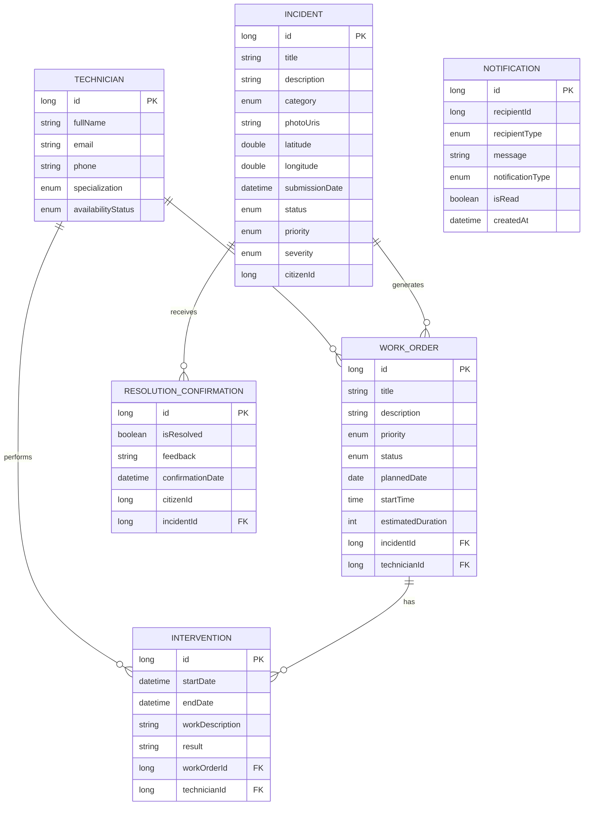

# Urban Incident service — data model

```mermaid
erDiagram
    TECHNICIAN ||--o{ WORK_ORDER : assigns
    TECHNICIAN ||--o{ INTERVENTION : performs
    INCIDENT ||--o{ WORK_ORDER : generates
    WORK_ORDER ||--o{ INTERVENTION : has
    INCIDENT ||--o{ RESOLUTION_CONFIRMATION : receives

    TECHNICIAN {
        long id PK
        string fullName
        string email
        string phone
        enum specialization
        enum availabilityStatus
    }
    INCIDENT {
        long id PK
        string title
        string description
        enum category
        string photoUris
        double latitude
        double longitude
        datetime submissionDate
        enum status
        enum priority
        enum severity
        long citizenId
    }
    WORK_ORDER {
        long id PK
        string title
        string description
        enum priority
        enum status
        date plannedDate
        time startTime
        int estimatedDuration
        long incidentId FK
        long technicianId FK
    }
    INTERVENTION {
        long id PK
        datetime startDate
        datetime endDate
        string workDescription
        string result
        long workOrderId FK
        long technicianId FK
    }
    RESOLUTION_CONFIRMATION {
        long id PK
        boolean isResolved
        string feedback
        datetime confirmationDate
        long citizenId
        long incidentId FK
    }
    NOTIFICATION {
        long id PK
        long recipientId
        enum recipientType
        string message
        enum notificationType
        boolean isRead
        datetime createdAt
    }
```
